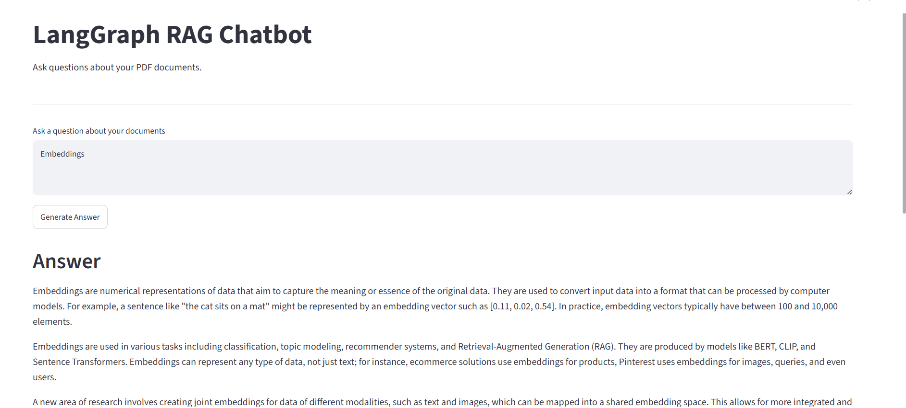
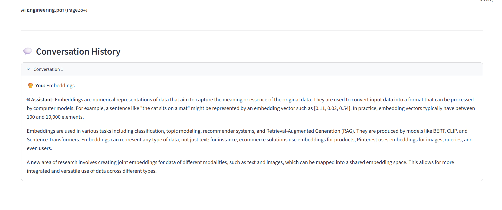

# 📚 LangGraph RAG Chatbot

<p align="center">


</p>

---

# 🏠 Home Screen

<p align="center">

</p>

---

# 💬 Conversation History

<p align="center">

</p>

---

# 1. Overview

The **LangGraph RAG Chatbot** is an AI-powered application that enables users to ask questions about PDF documents using **Retrieval-Augmented Generation (RAG)**.

Instead of relying solely on the knowledge of a Large Language Model (LLM), the application retrieves relevant document chunks from a vector database and uses them as context to generate accurate, grounded answers.

The project is built using **LangGraph**, allowing the retrieval and generation workflow to be represented as a graph, making it modular, scalable, and ready for future agentic workflows.

---

# 2. Problem Statement

Large Language Models often:

- Hallucinate answers
- Lack knowledge of private documents
- Cannot access organization-specific information
- Have outdated knowledge

The objective of this project is to build a chatbot capable of answering questions using custom PDF documents while minimizing hallucinations through Retrieval-Augmented Generation.

---

# 3. System Architecture

```text
                  PDF Documents
                        │
                        ▼
                PDF Loader (PyPDF)
                        │
                        ▼
              Recursive Text Splitter
                        │
                        ▼
              HuggingFace Embeddings
          (BAAI/bge-small-en-v1.5)
                        │
                        ▼
                  Chroma Vector DB
                        │
                        ▼
                  Retriever (MMR)
                        │
                        ▼
                 LangGraph Workflow
                        │
                        ▼
             Qwen2.5-7B-Instruct LLM
             (Hugging Face Inference API)
                        │
                        ▼
               Streamlit User Interface
```

---

# 4. Screenshots

### Home

```
assets/home.png
```

### Conversation History

```
assets/history.png
```

---

# 5. Features

- 📄 PDF Question Answering
- 🤖 LangGraph-based workflow
- 📚 Retrieval-Augmented Generation (RAG)
- 🧠 Conversation History
- 🔎 Semantic Search using ChromaDB
- 📑 Automatic Source Citation
- 📦 Persistent Vector Database
- ⚡ Hugging Face Qwen2.5 API
- 🎯 HuggingFace BGE Embeddings
- 💻 Streamlit Interface
- 🔄 Modular Architecture
- 📈 LangSmith Integration (Optional)

---

# 6. Tech Stack

| Category | Technology |
|-----------|------------|
| Language | Python |
| Framework | LangGraph |
| LLM | Qwen2.5-7B-Instruct |
| Embeddings | BAAI/bge-small-en-v1.5 |
| Vector Database | ChromaDB |
| Retrieval | Max Marginal Relevance (MMR) |
| Frontend | Streamlit |
| PDF Loader | PyPDF |
| Prompt Framework | LangChain |
| Tracing | LangSmith |
| Environment | Python Dotenv |

---

# 7. Project Structure

```
langgraph-rag/
│
├── app.py
├── config.py
├── graph.py
├── ingest.py
├── nodes.py
├── prompts.py
├── retriever.py
├── state.py
├── utils.py
├── requirements.txt
├── .env
│
├── assets/
│   ├── home.png
│   └── history.png
│
├── documents/
│
├── vectorstore/
│
└── README.md
```

---

# 8. Installation

Clone the repository

```bash
git clone https://github.com/yourusername/langgraph-rag.git

cd langgraph-rag
```

Create virtual environment

```bash
python -m venv venv
```

Activate virtual environment

Windows

```bash
venv\Scripts\activate
```

Linux / Mac

```bash
source venv/bin/activate
```

Install dependencies

```bash
pip install -r requirements.txt
```

---

# 9. How to Run

### Step 1

Add PDF files inside

```
documents/
```

### Step 2

Create vector database

```bash
python ingest.py
```

### Step 3

Run Streamlit

```bash
streamlit run app.py
```

---

# 10. Usage

1. Launch the application.
2. Add PDF documents.
3. Ask questions about the uploaded documents.
4. The application retrieves the most relevant document chunks.
5. Qwen2.5 generates an answer using only the retrieved context.
6. View source pages for every response.
7. Continue asking follow-up questions using conversation history.

---

# 11. Model Evaluation

### Embedding Model

**BAAI/bge-small-en-v1.5**

Reasons for selection:

- Lightweight
- High retrieval quality
- Excellent semantic search performance
- Fast inference
- Open-source

### Language Model

**Qwen2.5-7B-Instruct**

Reasons for selection:

- Strong instruction following
- Excellent reasoning ability
- Good RAG performance
- Supports long context
- Available through Hugging Face Inference API

### Retrieval Strategy

Max Marginal Relevance (MMR)

Configuration

```python
k = 4
fetch_k = 10
lambda_mult = 0.7
```

Benefits

- Reduces duplicate context
- Improves answer diversity
- Better document coverage

---

# 12. Sample Output

### User

```
Explain Embeddings.
```

### Assistant

```
Embeddings are digital fingerprints or lists of numbers that represent the meaning of words, images, or data. Machine learning models group similar things close together in a math space. This allows AI to search, sort, and recommend content by meaning rather than exact words.
```

### Sources

```
AI Engineering.pdf
```

---

# 13. Future Improvements

- Agentic RAG Workflow
- Query Rewriting
- Document Relevance Grading
- Hallucination Detection
- Streaming Responses
- Hybrid Search (BM25 + Vector Search)
- Cross-Encoder Reranking
- Multi-PDF Upload
- Authentication
- Docker Deployment
- FastAPI Backend
- Cloud Deployment
- Persistent Chat Memory
- Multi-Agent Architecture

---

# 14. Skills Demonstrated

- Retrieval-Augmented Generation (RAG)
- LangGraph Workflow Design
- LangChain
- Prompt Engineering
- Hugging Face Inference API
- Vector Databases
- ChromaDB
- Semantic Search
- Embedding Models
- LLM Integration
- Streamlit Development
- Python
- Environment Configuration
- Modular Software Architecture
- AI Application Development

---

# 15. Author

**Samarth Gupta**

B.Tech Electronics and Communication Engineering  
School of Engineering  
Jawaharlal Nehru University

**GitHub**

```
https://github.com/Samarth041
```

**LinkedIn**

```
https://www.linkedin.com/in/samarth-gupta-097617316/
```

---

## ⭐ If you found this project useful, consider giving it a star on GitHub!